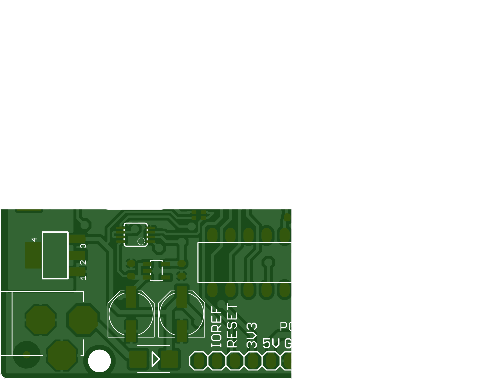
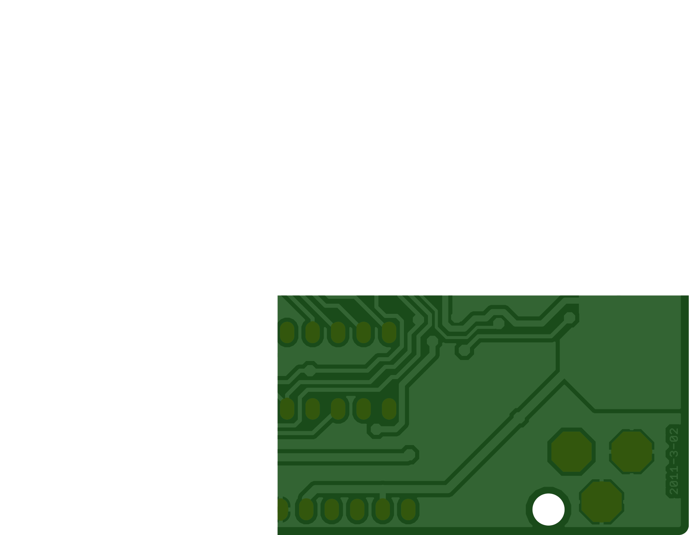

# Convert Gerber files to SVG using JavaScript / NodeJS
## Sources
- [Source for the ESP32 Gerber files](https://www.espressif.com/en/support/download/documents/development-board?keys=&field_type_tid%5B%5D=127)
- [Source for Arduino Uno Gerber files](https://github.com/tracespace/tracespace/tree/v5/packages/fixtures/boards)
## How to run
- `npm install`
- `npm start`

</svg>
</svg>
